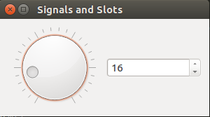
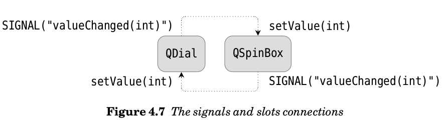

Qt库第一个认识到在几乎所有情况下，程序员不需要或甚至不想知道所有的底层细节：他们不在乎按钮是如何按下，他们只是想知道它是按下的以便他们能够适当地做出反应。因此，Qt和PyQt提供了两种通信机制：底层事件处理机制，类似于所有其他GUI库提供的机制，以及Trolltech（Qt的制造商）所称的高级机制 "信号和槽"。<br>
每个QObject,包括所有的PyQt的小部件，因为它们从QWidget(一个QObject的子类)派生，都支持信号和槽机制。特别地，它们能够通知状态的改变，例如当复选框变为选中或未选中时，以及其他重要的事件，例如当点击按钮（通过任何方式）时。 所有的PyQt的小部件有一组预定义的信号。 每当一个信号发射，默认情况下PyQt只是抛出它！要注意到信号，我们就必须将其连接到槽。在C ++ / Qt中，槽是必须用特殊语法声明的方法; 但在PyQt中，它们可以是任何我们喜欢的可调用的对象（例如，任何函数或方法），并且在定义它们时不需要特殊的语法。 大多数小部件也有预定义的槽，因此在某些情况下，我们可以将预定义的信号连接到预定义的槽，而不必执行任何其他操作来获得我们想要的行为。PyQt在这方面比C ++ / Qt更通用，因为我们不仅可以连接到槽，而且可以连接到任何可调用，并且从PyQt4.2开始，可以动态添加"预定义"信号和插槽到QObject中。让我们来看看信号和槽在实践中如何适用于如图所示4.6的信号和槽程序。



QDial和QSpinBox小部件都有valueChanged（）信号，当发出时，它们携带新值。 它们都有setValue（）槽，它们取整数值。 因此，我们可以将这两个小部件彼此连接，使得无论用户改变什么，都将导致另一个相应地改变:



# !/usr/bin/python

# -_- coding: utf8-_-

''' Created on 2016年12月10日

@author: shiyi ''' import sys from PyQt4.QtGui import _from PyQt4.QtCore import_

class Form(QDialog):

```
def __init__(self, parent=None):
    super(Form, self).__init__(parent)
    dial = QDial()
    dial.setNotchesVisible(True)
    spinbox = QSpinBox()
    layout = QHBoxLayout()
    layout.addWidget(dial)
    layout.addWidget(spinbox)
    self.setLayout(layout)
    self.connect(dial, SIGNAL("valueChanged(int)"),
                 spinbox.setValue)
    self.connect(spinbox, SIGNAL("valueChanged(int)"), dial.setValue)
    self.setWindowTitle("Signals and Slots")
```

app = QApplication(sys.argv) form = Form() form.show() app.exec_() 

由于两个小部件以这种方式连接，如果用户把Dial移动到20,Dial将发出一个valueChanged（20）的信号，这将反过来导致调用Spinbox的setValue（）槽，以20作为参数。 但是，因为它的值现在已经改变，Spinbox将发出一个valueChanged（20）信号，这反过来将调用Dial的setValue（）插槽，以20作为参数。所以看起来我们会得到一个无限循环。但是实际上如果值没有实际改变，valueChanged（）信号不会被发射。这是因为写入值改变槽的标准方法是通过将新值与现有值进行比较开始的。如果值相同，我们什么都不做，并返回; 否则，我们应用改变并发出信号以宣布状态的改变。连接如图4.7所示。



现在让我们看看连接的一般语法。 我们假设PyQt模块已经使用**from ... import *** 语法导入，并且s和w是QObjects，通常是小部件，s通常是self:

 s.connect(w, SIGNAL("signalSignature"), functionName) s.connect(w, SIGNAL("signalSignature"), instance.methodName) s.connect(w, SIGNAL("signalSignature"),instance, SLOT("slotSignature")) 

signalSignature是信号的名称，以及括号中的逗号分隔的参数类型名称列表（可能为空）。 如果信号是一个Qt信号，类型名称必须是C++类型名称，如int和QString。 C++类型名称可能相当复杂，每个类型名称可能包括一个或多个**const**，*****和**＆**。当我们将它们写为信号（或槽）签名时，我们可以丢弃任何**const**s和**＆**s，但必须保留任何*****s。例如，通过QString的几乎每个Qt信号都使用const QString的参数类型，但是在PyQt中，仅仅使用QString就足够了。 另一方面，QListWidget具有带有签名itemActivated（QListWidgetItem *）的信号，并且我们必须写入与这个完全一样的信号。 PyQt信号在它们被实际发射时被定义，并且可以具有任何数量的任何类型的参数，如我们将很快看到的。 slotSignature与signalSignature具有相同的形式，除了名称是Qt时隙。 插槽可以不具有比连接到其的信号更多的自变量，但是可以具有更少的自变量; 那么将丢弃额外的参数。相应的信号和槽参数必须具有相同的类型，例如，我们无法将QDial的valueChanged（int）信号连接到QLineEdit的setText（QString）槽。 在我们的dial和spinbox示例中，我们使用instance.methodName语法，就像我们对本章前面所示的示例应用程序一样。 但是当槽实际上是一个Qt槽而不是一个Python方法时，使用SLOT（）语法更有效：

 self.connect(dial, SIGNAL("valueChanged(int)"),spinbox, SLOT("setValue(int)")) self.connect(spinbox, SIGNAL("valueChanged(int)"),dial, SLOT("setValue(int)")) 

我们已经看到，可以将多个信号连接到同一个插槽。 也可以将单个信号连接到多个时隙。 虽然很少，我们也可以将信号连接到另一个信号：在这种情况下，当第一个信号被发射时，它将导致它连接的信号被发射。 连接使用QObject.connect（）; 他们可以使用QObject.disconnect（）打破。 在实践中，我们很少需要断开连接，因为例如，PyQt将自动断开所有涉及被删除的对象的连接。 到目前为止，我们已经看到了如何连接到信号，以及如何编写插槽，这是普通的函数或方法。 我们知道信号被发射以表示状态变化或其他重要事件。 但是如果我们想创建一个发出自己的信号的组件呢？ 这很容易实现使用QObject.emit（）。 例如，这里是一个完整的QSpinBox子类，发出自己的自定义atzero信号，并且还传递一个数字：

 class ZeroSpinBox(QSpinBox): zeros = 0 def **init**(self, parent=None): super(ZeroSpinBox, self).**init**(parent) self.connect(self, SIGNAL("valueChanged(int)"), self.checkzero) def checkzero(self): if self.value() == 0: self.zeros += 1 self.emit(SIGNAL("atzero"), self.zeros) 

我们连接到Spinbox自己的valueChanged（）信号，并将其调用我们的checkzero（）插槽。 如果值恰好为0，则checkzero（）槽发出零值信号，以及它已经为零的次数的计数; 传递这样的附加数据是可选的。 缺少信号的括号很重要：它告诉PyQt这是一个"短路"信号。 没有参数（因此没有括号）的信号是短路Python信号。 当发出这样的信号时，任何数据都可以作为附加参数传递给**emit（）**方法，并且它们作为Python对象传递。 这避免了将参数转换为**C ++**数据类型和从**C ++**数据类型转换的开销，并且还意味着可以传递任意Python对象，甚至不能转换为**C ++**数据类型的对象。 具有至少一个自变量的信号是Qt信号或非短路Python信号。 在这些情况下，PyQt将检查信号是否是Qt信号，如果不是，则会假定它是一个Python信号。 在任何一种情况下，参数都将转换为**C ++**数据类型。 下面是我们如何连接到窗体的**__init__（）**方法中的信号：

 zerospinbox = ZeroSpinBox() ... self.connect(zerospinbox, SIGNAL("atzero"), self.announce) 

同样，我们不能使用括号，因为它是一个短路信号。 为了完整性，这里是它连接到的形式：

 def announce(self, zeros): print "ZeroSpinBox has been at zero %d times" % zeros 

如果我们使用带有标识符但没有括号的**SIGNAL（）**函数，我们如前所述指定短路信号。 我们可以使用这种语法来发出短路信号，并连接到它们。 这两种用法都在示例中显示。 如果我们使用**SIGNAL（）**函数和**signalSignature**（一个可能是空的大写逗号分隔的PyQt类型列表），我们指定一个Python或Qt信号。 （Python信号是在Python代码中发出的; Qt信号是从底层**C ++**对象发出的信号。）我们可以使用这种语法来发出Python和Qt信号，并连接到它们。 这些信号可以连接到任何可调用的，即任何功能或方法，包括Qt槽; 它们也可以使用**SLOT（）**语法与**slotSignature**连接。 PyQt检查信号是否是Qt信号，如果不是，则假定它是一个Python信号。 如果我们使用括号，即使对于Python信号，参数必须可以转换为**C ++**数据类型。 现在我们来看另一个例子，一个小的自定义非GUI类，它有一个信号和一个槽，并显示该机制不限于GUI类 - 任何QObject子类可以使用信号和槽。

 class TaxRate(QObject): def **init**(self): super(TaxRate, self).**init**() self.**rate = 17.5 def rate(self): return self.**rate def setRate(self, rate): if rate != self.**rate: self.**rate = rate self.emit(SIGNAL("rateChanged"), self.__rate) 

可以连接**rate（）**和**setRate（）**方法，因为任何Python可调用都可以用作插槽。 如果速率改变，我们更新私有**__rate**值并发出一个自定义的**rateChanged**信号，给出新的速率作为参数。 我们还使用了更快的短路语法。 如果我们想使用标准语法，唯一的区别是信号将被写为**SIGNAL（"rateChanged（float）"）**。 如果我们将**rateChanged**信号连接到**setRate（）**槽，由于**if**语句，不会发生无限循环。 让我们看看使用中的类。 首先，我们将声明一个函数，当速率改变时被调用：

 def rateChanged(value): print "TaxRate changed to %.2f%%" % value 

现在我们将尝试：

 vat = TaxRate() vat.connect(vat, SIGNAL("rateChanged"), rateChanged) vat.setRate(17.5)

# No change will occur (new rate is the same)

vat.setRate(8.5)

# A change will occur (new rate is different)



这将导致只有一行输出到控制台："**TaxRate**更改为8.50％"。在前面的示例中，我们将多个信号连接到同一个插槽，我们不在乎谁发出信号。 但有时我们想要将两个或多个信号连接到同一个插槽，并且根据调用者的不同，插槽的行为会有所不同。 在本节的最后一个例子中，我们将解决这个问题。 图4.8中显示的**Connections**程序有五个按钮和一个标签。 当点击其中一个按钮时，信号和插槽机制用于更新标签的文本。 下面是如何在窗体的**__init__（）**方法中创建第一个按钮：

 button1 = QPushButton("One") 

所有其他按钮都以相同的方式创建，不同之处仅在于它们的变量名称和传递给它们的文本。 我们将从最简单的连接开始，这是由button1使用。 这里是**__init__（）**方法的**connect（）**调用：

 self.connect(button1, SIGNAL("clicked()"), self.one) 

我们为此按钮使用了专用方法：

 def one(self): self.label.setText("You clicked button 'One'") 

将按钮的clicked（）信号连接到适当响应的单个方法可能是最常见的连接情况。但是如果大多数处理是相同的，只是一些参数化取决于按下哪个特定按钮？ 在这种情况下，通常最好将每个按钮连接到同一个插槽。 有两种方法可以做到这一点。 一个是使用部分函数应用程序来包装具有参数的插槽，以便在调用插槽时，使用调用它的按钮对其进行参数化。 另一个是要求PyQt告诉我们哪个按钮称为插槽。 我们将展示这两种方法，从偏函数应用(partial function application)开始。 回到第65页，我们创建了一个包装器函数，它使用Python 2.5的functools.partial（）函数或者我们自己简单的partial（）函数：

 import sys if sys.version_info[:2] < (2, 5): def partial(func, arg): def callme(): return func(arg) return callme else: from functools import partial 

使用partial（）我们现在可以将一个插槽和一个按钮名称。 所以我们可能会试着这样做：

 self.connect(button2, SIGNAL("clicked()"),partial(self.anyButton, "Two")) # WRONG for PyQt 4.0-4.2 

不幸的是，这将不适用于4.3之前的PyQt版本。 包装器函数是在connect（）调用中创建的，但是一旦connect（）调用完成，包装器就会超出范围并被垃圾回收。 从PyQt 4.3开始，用functools.partial（）制作的包装器在用于像这样的连接时会被特别处理。 这意味着连接的函数不会被垃圾回收，因此前面显示的代码将正常工作。 对于PyQt 4.0,4.1和4.2，我们仍然可以使用partial（）：我们只需要保留对包装器的引用 - 除了connect（）调用之外，我们不会使用引用，但事实上它是一个属性 的表单实例将确保包装器函数在表单存在时不会超出范围，因此将工作。 所以连接实际上是这样：

 self.button2callback = partial(self.anyButton, "Two") self.connect(button2, SIGNAL("clicked()"), self.button2callback) 

当按钮2被点击时，将使用包含文本"Two"的字符串参数来调用anyButton（）方法。 以下是此方法的外观：

 def anyButton(self, who): self.label.setText("You clicked button '%s'" % who) 

我们可以使用这个插槽的所有按钮使用我们刚刚显示的partial（）函数。 事实上，我们可以避免使用partial（），并得到相同的结果：

 self.button3callback = lambda who="Three": self.anyButton(who) self.connect(button3, SIGNAL("clicked()"),self.button3callback) 

这里我们创建了一个lambda函数，该函数由按钮的名称参数化。 它的工作原理与partial（）技术相同，并且调用相同的anyButton（）方法，只有使用lambda来创建包装器。 button2callback（）和button3callback（）调用anyButton（）; 它们之间的唯一区别是第一个通过"Two"作为其参数，第二个通过"Three"。 如果我们使用PyQt 4.1.1或更高版本，并且我们使用lambda回调，我们不必保留对它们的引用。 这是因为PyQt在用于在连接中创建包装时专门处理lambda。 （这是同样的特殊处理，期望扩展到functools.partial（）在PyQt 4.3）。因此，我们可以直接使用lambda在connect（）调用。 例如：

 self.connect(button3, SIGNAL("clicked()"),lambda who="Three": self.anyButton(who)) 

包装技术工作得很好，但是有一个替代方法稍微更多地涉及，但在某些情况下可能是有用的，特别是当我们不想包装我们的调用。 这种其他技术用于响应button4和button5。 这里是他们的联系：

 self.connect(button4, SIGNAL("clicked()"), self.clicked) self.connect(button5, SIGNAL("clicked()"), self.clicked) 

注意，我们不包装它们都连接的clicked（）方法，因此看起来好像没有办法告诉哪个按钮叫做clicked（）方法。 ★但是，实现清楚地表明，我们可以区分是否我们想：

 def clicked(self): button = self.sender() if button is None or not isinstance(button, QPushButton): return self.label.setText("You clicked button '%s'" % button.text()) 

在插槽内，我们可以总是调用sender（）来发现调用信号来自哪个QObject。（如果使用正常的方法调用来调用槽，这可以是None）尽管我们知道我们只连接了这个槽的按钮，但我们还是仔细检查。我们使用了isinstance（），但是我们可以使用hasattr（button，"text"）。如果我们把所有的按钮连接到这个插槽，它将正确地为他们工作。 一些程序员不喜欢使用sender（），因为他们觉得它不是很好的面向对象的风格，所以他们倾向于使用部分功能应用程序，当这样的需求出现。 实际上有一种其他技术可以用来获得包装函数和参数的效果。它使用QSignalMapper类，其使用的示例在第9章中显示。 在一些情况下，可以将槽称为信号的结果，并且在槽中直接或间接执行的处理导致最初称为槽的信号被再次调用，导致无限循环。这样的循环在实践中是罕见的。两个因素有助于减少循环的可能性。首先，只有在发生真实变化时才发射一些信号。例如，如果QSpinBox的值由用户更改或通过setValue（）调用以编程方式更改，则只有当新值与当前值不同时，才会发出其valueChanged（）信号。第二，一些信号仅作为用户动作的结果而发射。例如，QLineEdit仅在用户更改文本时发出其textEdited（）信号，而不是在通过setText（）调用在代码中更改时发出它的textEdited（）信号。 如果一个信号-槽循环已经发生，自然，首先要检查的是代码的逻辑是正确的：我们实际上是在做我们想要的处理？如果逻辑是正确的，并且我们还有一个循环，我们可以通过改变我们连接的信号来打破循环-例如，将由于程序化变化而发出的信号替换为被发射的信号仅作为用户交互的结果。如果问题仍然存在，我们可以使QObject.blockSignals（）在我们的代码中的某些地方发出信号，QObject.blockSignals（）被所有QWidget类继承，并传递一个Boolean-True以停止对象发出信号，而False则恢复信号。 这完成了我们对信号和时隙机制的正式覆盖。在本书其余部分所示的几乎所有示例中，我们将看到更多的信号和时隙示例。大多数其他GUI库已经以某种形式或其他形式复制了机制。这是因为信号和槽机制是非常有用和强大的，并且让程序员自由地专注于它们的应用程序的逻辑，而不必关心用户如何调用特定操作的细节。
