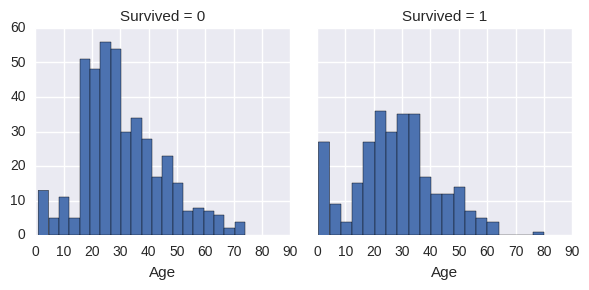
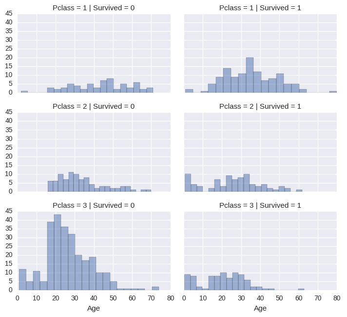
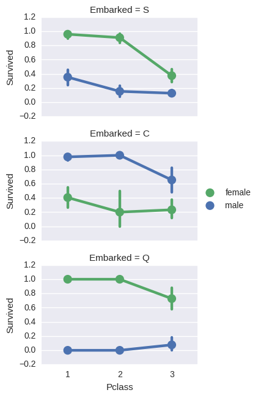
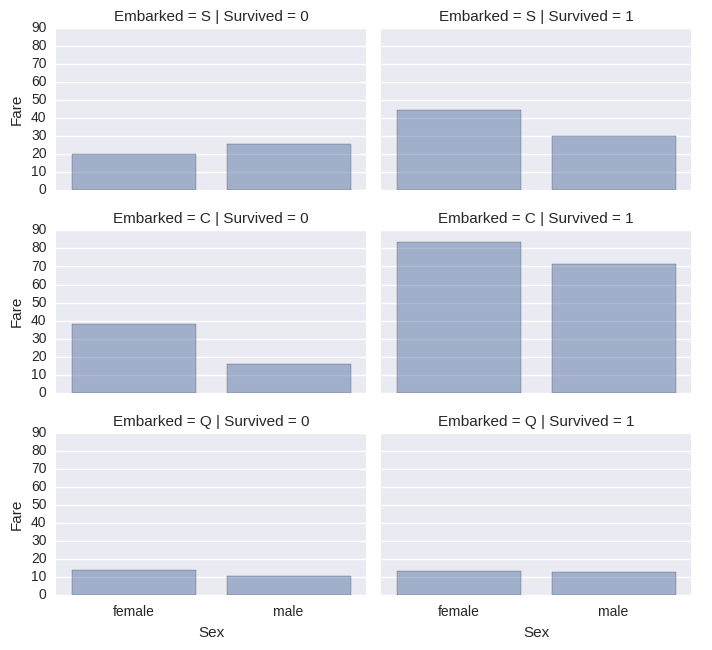
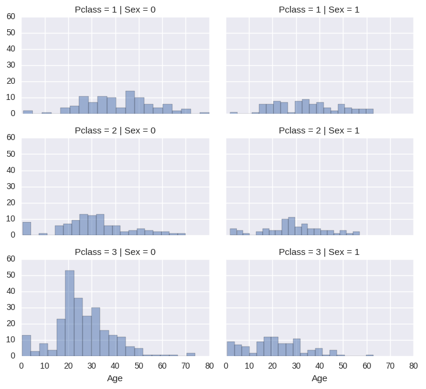

## 1. 数据科学问题解决思路

-   寻找问题或者定义问题
-   获取训练和测试数据集
-   预处理，准备，清理数据
-   分析，识别模式和探索数据
-   建模，预测和解决问题
-   可视化，制作报表，呈现问题解决步骤和最终的解决方案
-   应用或者提交分析结果

以上这些步骤是解决数据科学问题的一般步骤，不过偶尔也有一些例外：

-   我们可能将多个阶段结合到一块儿使用，我们可以通过可视化的方式分析数据
-   比预先更早地执行某一阶段的人物，我们可能在wrangle数据之前先analysis
-   某一阶段执行多次，可视化可能会在多个阶段内
-   完全放弃某一阶段，我们可能不需要执行所有阶段来得到我们所需要的结果

### 1.1 问题及问题的定义

泰坦尼克号沉船事件是历史上最著名的沉船事件之一。1912年4月15日在他的处女航中与冰山相撞沉没，2224名乘客与船员中有1502人丧生。这一事件震惊了国际社会，并直接导致了船舶业更严格的安全条例的出台。 造成如此重大伤亡的原因之一就是因为没有为乘客和船员准备足够的救生船。在沉船事件中幸存存在一定的随机因素，比如妇女，儿童和上层阶级更容易生存下来。 我们的工作就是预测一个乘客是否能在泰坦尼克号事件中幸存，对于测试集中的每一个PassengerId,都要预测出是否幸存的变量Survived(0,1)。

### 1.2 各阶段目标

-   分类(Classifying)。我们可能希望对我们的样品进行分类或分类。我们还可能想要理解不同类别对我们目标的影响或相关。

-   相关(Correlating)。可以基于训练数据集内的可用特征来处理该问题。 数据集中的哪些功能对我们的解决方案目标有重大影响？ 从统计学的角度看，一个特征和解决方案目标之间有相关性吗？ 随着特征值改变，目标状态也改变，反之亦然？ 这可以测试给定数据集中的数值和分类特征。 我们还可能想要确定除了生存之外的特征之间的相关性以用于后续目标和工作流阶段。 关联某些特征可以帮助创建，完成或校正特征。

-   转换(Converting)。对于建模阶段，需要准备数据。根据模型算法的选择，可能需要将所有特征转换为数值等效值。因此，例如将文本分类值转换为数值。

-   完成(Completing)。数据准备还可能需要我们估计特征内的任何缺失值。当没有缺失值时，模型算法可能最有效。

-   纠正(Correcting)。我们还可以分析给定的训练数据集中的特征内的错误或可能是完备的值，并试图改变这些值或排除包含错误的样本。一种方法是检测我们的样品或特征中的任何离群值。如果一个特征不是对分析有影响，或者可能显着地偏斜结果，我们也可以完全丢弃该特征。

-   创建(Creating)。我们可以基于现有特征或一组特征创建新特征，以使新特征遵循相关性，转换，完整性目标。

-   图表(Charting)。如何根据数据的性质和解决方案目标选择正确的可视化图表和图表。一个好的开始是阅读Tableau论文，哪个图表或图表适合您？



# 数据分析和预处理

import pandas as pd
import numpy as np
import random as rnd

# 可视化

import seaborn as sns
import matplotlib.pyplot as plt
%matplotlib inline

# 机器学习

from sklearn.linear_model import LogisticRegression
from sklearn.svm import SVC, LinearSVC
from sklearn.ensemble import RandomForestClassifier
from sklearn.neighbors import KNeighborsClassifier
from sklearn.naive_bayes import GaussianNB
from sklearn.linear_model import Perceptron
from sklearn.linear_model import SGDClassifier
from sklearn.tree import DecisionTreeClassifier

# 读取数据

train_df = pd.read_csv('./data/train.csv')
test_df = pd.read_csv('./data/test.csv')
combine = [train_df, test_df]



## 2. 描述性数据分析

### 2.1 数据集中包含哪些特征

#### 哪些是分类变量

分类变量可分为名义变量，排序变量，比率变量或者区间值

-   分类变量: Survived, Sex, and Embarked. 排序变量: Pclass

#### 哪些是数值变量

连续性变量，离散变量，时间序列

-   Continous: Age, Fare. Discrete: SibSp, Parch.

#### 哪些变量是混合数据类型

-   Ticket is a mix of numeric and alphanumeric data types. Cabin is alphanumeric.

#### 哪些变量可能包含有错误或者错别字

-   Name feature may contain errors or typos as there are several ways used to describe a name including titles, round brackets, and quotes used for alternative or short names.

#### 哪些变量包含空白或者空值

-   Cabin > Age > Embarked features contain a number of null values in that order for the training dataset.
-   Cabin > Age are incomplete in case of test dataset.

#### 各个变量的数据类型

-   Seven features are integer or floats. Six in case of test dataset.
-   Five features are strings (object).


print train_df.columns.values


['PassengerId' 'Survived' 'Pclass' 'Name' 'Sex' 'Age' 'SibSp' 'Parch'
     'Ticket' 'Fare' 'Cabin' 'Embarked']



# preview the data

train_df.head()

<pre>

  <table border="1" class="dataframe">
  <thead><tr style="text-align: left;"><th></th><th>PassengerId</th><th>Survived</th><th>Pclass</th><th>Name</th><th>Sex</th><th>Age</th><th>SibSp</th><th>Parch</th><th>Ticket</th><th>Fare</th><th>Cabin</th><th>Embarked</th></tr></thead>
  <tbody><tr><th>0</th><td>1</td><td>0</td><td>3</td><td>Braund, Mr. Owen Harris</td><td>male</td><td>22.0</td><td>1</td><td>0</td><td>A/5 21171</td><td>7.2500</td><td>NaN</td><td>S</td></tr><tr><th>1</th><td>2</td><td>1</td><td>1</td><td>Cumings, Mrs. John Bradley (Florence Briggs Th...</td><td>female</td><td>38.0</td><td>1</td><td>0</td><td>PC 17599</td><td>71.2833</td><td>C85</td><td>C</td></tr><tr><th>2</th><td>3</td><td>1</td><td>3</td><td>Heikkinen, Miss. Laina</td><td>female</td><td>26.0</td><td>0</td><td>0</td><td>STON/O2\. 3101282</td><td>7.9250</td><td>NaN</td><td>S</td></tr><tr><th>3</th><td>4</td><td>1</td><td>1</td><td>Futrelle, Mrs. Jacques Heath (Lily May Peel)</td><td>female</td><td>35.0</td><td>1</td><td>0</td><td>113803</td><td>53.1000</td><td>C123</td><td>S</td></tr><tr><th>4</th><td>5</td><td>0</td><td>3</td><td>Allen, Mr. William Henry</td><td>male</td><td>35.0</td><td>0</td><td>0</td><td>373450</td><td>8.0500</td><td>NaN</td><td>S</td></tr></tbody>
</table>

</pre>


train_df.tail()


<pre>

  <table border="1" class="dataframe">
  <thead><tr style="text-align: right;"><th></th><th>PassengerId</th><th>Survived</th><th>Pclass</th><th>Name</th><th>Sex</th><th>Age</th><th>SibSp</th><th>Parch</th><th>Ticket</th><th>Fare</th><th>Cabin</th><th>Embarked</th></tr></thead>
  <tbody><tr><th>886</th><td>887</td><td>0</td><td>2</td><td>Montvila, Rev. Juozas</td><td>male</td><td>27.0</td><td>0</td><td>0</td><td>211536</td><td>13.00</td><td>NaN</td><td>S</td></tr><tr><th>887</th><td>888</td><td>1</td><td>1</td><td>Graham, Miss. Margaret Edith</td><td>female</td><td>19.0</td><td>0</td><td>0</td><td>112053</td><td>30.00</td><td>B42</td><td>S</td></tr><tr><th>888</th><td>889</td><td>0</td><td>3</td><td>Johnston, Miss. Catherine Helen "Carrie"</td><td>female</td><td>NaN</td><td>1</td><td>2</td><td>W./C. 6607</td><td>23.45</td><td>NaN</td><td>S</td></tr><tr><th>889</th><td>890</td><td>1</td><td>1</td><td>Behr, Mr. Karl Howell</td><td>male</td><td>26.0</td><td>0</td><td>0</td><td>111369</td><td>30.00</td><td>C148</td><td>C</td></tr><tr><th>890</th><td>891</td><td>0</td><td>3</td><td>Dooley, Mr. Patrick</td><td>male</td><td>32.0</td><td>0</td><td>0</td><td>370376</td><td>7.75</td><td>NaN</td><td>Q</td></tr></tbody>
</table>

</pre>


train_df.info()
print '_'\*40
test_df.info()


    <class 'pandas.core.frame.DataFrame'>
    RangeIndex: 891 entries, 0 to 890
    Data columns (total 12 columns):
    PassengerId    891 non-null int64
    Survived       891 non-null int64
    Pclass         891 non-null int64
    Name           891 non-null object
    Sex            891 non-null object
    Age            714 non-null float64
    SibSp          891 non-null int64
    Parch          891 non-null int64
    Ticket         891 non-null object
    Fare           891 non-null float64
    Cabin          204 non-null object
    Embarked       889 non-null object
    dtypes: float64(2), int64(5), object(5)
    memory usage: 83.6+ KB
    ________________________________________
    <class 'pandas.core.frame.DataFrame'>
    RangeIndex: 418 entries, 0 to 417
    Data columns (total 11 columns):
    PassengerId    418 non-null int64
    Pclass         418 non-null int64
    Name           418 non-null object
    Sex            418 non-null object
    Age            332 non-null float64
    SibSp          418 non-null int64
    Parch          418 non-null int64
    Ticket         418 non-null object
    Fare           417 non-null float64
    Cabin          91 non-null object
    Embarked       418 non-null object
    dtypes: float64(2), int64(4), object(5)
    memory usage: 36.0+ KB

### 数值型变量的分布

-   样本包含891份数据或者2224名登船乘客中的40%.
-   Survived是一个分类变量，0表示，1表示幸存.
-   样本中大约32%的人幸存代表着总体船员的幸存率大约为32%.
-   大部分乘客(>75%)并没有随父母或孩子一起出行.
-   大约30%的乘客有伴侣或者兄弟姐妹在船上.
-   部分乘客(\<1%)的船费存在很大差异,最高的高达$512.
-   65-80岁乘客占所有乘客的不到1%


train_df.describe()

# Review survived rate using `percentiles=[.61, .62]` knowing our problem description mentions 38% survival rate.

# Review Parch distribution using `percentiles=[.75, .8]`

# SibSp distribution `[.68, .69]`

# Age and Fare `[.1, .2, .3, .4, .5, .6, .7, .8, .9, .99]`



    /usr/local/lib/python2.7/dist-packages/numpy/lib/function_base.py:3834: RuntimeWarning: Invalid value encountered in percentile
      RuntimeWarning)
<pre>

  <table border="1" class="dataframe">
  <thead><tr style="text-align: right;"><th></th><th>PassengerId</th><th>Survived</th><th>Pclass</th><th>Age</th><th>SibSp</th><th>Parch</th><th>Fare</th></tr></thead>
  <tbody><tr><th>count</th><td>891.000000</td><td>891.000000</td><td>891.000000</td><td>714.000000</td><td>891.000000</td><td>891.000000</td><td>891.000000</td></tr><tr><th>mean</th><td>446.000000</td><td>0.383838</td><td>2.308642</td><td>29.699118</td><td>0.523008</td><td>0.381594</td><td>32.204208</td></tr><tr><th>std</th><td>257.353842</td><td>0.486592</td><td>0.836071</td><td>14.526497</td><td>1.102743</td><td>0.806057</td><td>49.693429</td></tr><tr><th>min</th><td>1.000000</td><td>0.000000</td><td>1.000000</td><td>0.420000</td><td>0.000000</td><td>0.000000</td><td>0.000000</td></tr><tr><th>25%</th><td>223.500000</td><td>0.000000</td><td>2.000000</td><td>NaN</td><td>0.000000</td><td>0.000000</td><td>7.910400</td></tr><tr><th>50%</th><td>446.000000</td><td>0.000000</td><td>3.000000</td><td>NaN</td><td>0.000000</td><td>0.000000</td><td>14.454200</td></tr><tr><th>75%</th><td>668.500000</td><td>1.000000</td><td>3.000000</td><td>NaN</td><td>1.000000</td><td>0.000000</td><td>31.000000</td></tr><tr><th>max</th><td>891.000000</td><td>1.000000</td><td>3.000000</td><td>80.000000</td><td>8.000000</td><td>6.000000</td><td>512.329200</td></tr></tbody>
</table>

</pre>

### 分类变量的分布

-   Names在数据集中是唯一的(count=unique=891)
-   性别变量（Sex）是个二值变量,65%的人是男性(top=male, freq=577/count=891)
-   仓室号码(Cabin)在样本中有多次重复，多位乘客可以共享一个仓室
-   登船城市（Embarked）有三个可能的值,S是最多的港口


train_df.describe(include=['O'])


<pre>

  <table border="1" class="dataframe">
  <thead><tr style="text-align: right;"><th></th><th>Name</th><th>Sex</th><th>Ticket</th><th>Cabin</th><th>Embarked</th></tr></thead>
  <tbody><tr><th>count</th><td>891</td><td>891</td><td>891</td><td>204</td><td>889</td></tr><tr><th>unique</th><td>891</td><td>2</td><td>681</td><td>147</td><td>3</td></tr><tr><th>top</th><td>Graham, Mr. George Edward</td><td>male</td><td>CA. 2343</td><td>C23 C25 C27</td><td>S</td></tr><tr><th>freq</th><td>1</td><td>577</td><td>7</td><td>4</td><td>644</td></tr></tbody>
</table>

</pre>

### 2.2 基于数据分析的假设

-   Correlating. 我们想知道每个特征与生存之间的关系。我们希望在项目的早期做到这一点，并在项目后期将这些快速相关性与建模的相关性相匹配。

-   Completing

    -   我们可能希望Complete Age变量，因为它与生存密切相关。
    -   我们可能希望complete Embarked变量，因为它也可能与生存或另一个重要变量相关。

-   Correlating

    -   Ticket可能会从我们的分析中删除，因为它包含高比例的重复（22％），票券和生存之间可能没有相关性。
    -   Cabin可能被丢弃，因为它是非常不完整的或在训练和测试数据集中包含许多空值。
    -   PassengerId可以从训练数据集中删除，因为它不会有助于生存。
    -   Name 相对不标准，可能不直接有助于生存，因此也许会被丢弃。

-   Creating

    -   我们可能想创建一个基于Parch和SibSp的新变量Family，以获取船上家庭成员的总数。
    -   我们可能需要从Name中提取Title作为新变量。
    -   我们可能想为年龄创建新变量年龄段。这将连续的数字特征转换为有序的分类特征。
    -   我们可能还想创建一个Fare范围的变量，如果它有助于我们的分析。

-   Classifying 我们还可以基于前面提到的问题描述来添加我们的假设。

    -   女性（Sex=female）更有可能存活。
    -   儿童（Age\<？）更有可能生存。
    -   上层乘客（Pclass = 1）更有可能存活。

### 2.3 通过透视表分析

为了确认我们的一些观察和假设，我们可以通过变量之间的列联表来探索各变量之间的关系。在这个阶段我们只能对没有空值的变量这样做。仅对于分类（Sex），序数（Pclass）或离散（SibSp，Parch）类型的变量有意义。

-   **Pclass**我们观察到Pclass = 1和Survived（Classifying #3）之间的显着相关性（> 0.5）。 我们决定在模型中包含这个特征。
-   **Sex**我们确认在问题定义期间的观察性别=女性有非常高的生存率在74％（Classifying #1）。
-   **SibSp**和**Parch**这些功能对于某些值具有零相关性。 最好从这些单独的特征（ Creating #1）中导出一个特征或一组特征。


train_df\[['Pclass', 'Survived']].groupby(['Pclass'], as_index=False).mean().sort_values(by='Survived', ascending=False)


<pre>

  <table border="1" class="dataframe">
  <thead><tr style="text-align: right;"><th></th><th>Pclass</th><th>Survived</th></tr></thead>
  <tbody><tr><th>0</th><td>1</td><td>0.629630</td></tr><tr><th>1</th><td>2</td><td>0.472826</td></tr><tr><th>2</th><td>3</td><td>0.242363</td></tr></tbody>
</table>

</pre>

train_df\[["Sex", "Survived"]].groupby(['Sex'], as_index=False).mean().sort_values(by='Survived', ascending=False)



<pre>

  <table border="1" class="dataframe">
  <thead><tr style="text-align: right;"><th></th><th>Sex</th><th>Survived</th></tr></thead>
  <tbody><tr><th>0</th><td>female</td><td>0.742038</td></tr><tr><th>1</th><td>male</td><td>0.188908</td></tr></tbody>
</table>

</pre>


train_df\[["SibSp", "Survived"]].groupby(['SibSp'], as_index=False).mean().sort_values(by='Survived', ascending=False)

<pre>

  <table border="1" class="dataframe">
  <thead><tr style="text-align: right;"><th></th><th>SibSp</th><th>Survived</th></tr></thead>
  <tbody><tr><th>1</th><td>1</td><td>0.535885</td></tr><tr><th>2</th><td>2</td><td>0.464286</td></tr><tr><th>0</th><td>0</td><td>0.345395</td></tr><tr><th>3</th><td>3</td><td>0.250000</td></tr><tr><th>4</th><td>4</td><td>0.166667</td></tr><tr><th>5</th><td>5</td><td>0.000000</td></tr><tr><th>6</th><td>8</td><td>0.000000</td></tr></tbody>
</table>

</pre>


train_df\[["Parch", "Survived"]].groupby(['Parch'], as_index=False).mean().sort_values(by='Survived', ascending=False)


<pre>

  <table border="1" class="dataframe">
  <thead><tr style="text-align: right;"><th></th><th>Parch</th><th>Survived</th></tr></thead>
  <tbody><tr><th>3</th><td>3</td><td>0.600000</td></tr><tr><th>1</th><td>1</td><td>0.550847</td></tr><tr><th>2</th><td>2</td><td>0.500000</td></tr><tr><th>0</th><td>0</td><td>0.343658</td></tr><tr><th>5</th><td>5</td><td>0.200000</td></tr><tr><th>4</th><td>4</td><td>0.000000</td></tr><tr><th>6</th><td>6</td><td>0.000000</td></tr></tbody>
</table>

</pre>

### 2.4 通过可视化的方式进行分析

#### 数值型变量的相关性

直方图对于分析像年龄这样的连续性变量时特别有用，范围或者区间有助于我们识别出有用的模式。直方图可以指定自定义的箱子或者同等范围 内箱子的数量，这有助于我们回答有关特定区间的相关性的问题（比如婴儿有更大的存活概率吗？）

**观察**

-   年龄小于四岁的婴儿具有较高的存活率
-   最老的乘客（80岁）活了下来
-   大部分15-25岁之间的年轻人遇难
-   大部分乘客都在15-35岁之间

**结论**

-   我们应该在我们的模型中考虑年龄（Classifying #2）
-   为年龄变量填充空值(completing #1)
-   我们要对年龄进行分组(creating #3)


g = sns.FacetGrid(train_df, col='Survived')
g.map(plt.hist, 'Age', bins=20)
 

    <seaborn.axisgrid.FacetGrid at 0x7f15cd138250>

#### 数值变量与排序变量之间的关系

**观察**

-   第三等级乘客占了总体的大多数，但他们大多没有幸存，验证了我们的（Classifying #2）
-   第二和第三等级乘客中的大部分婴儿都存活了,进一步验证了Classifying #2
-   大部分第一等级的乘客都存活了，验证了Classifying #3
-   乘客的等级随年龄变化而变化

**结论**

-   在模型训练中考虑乘客等级



# grid = sns.FacetGrid(train_df, col='Pclass', hue='Survived')

grid = sns.FacetGrid(train_df, col='Survived', row='Pclass', size=2.2, aspect=1.6)
grid.map(plt.hist, 'Age', alpha=.5, bins=20)
grid.add_legend();


## 分类变量之间的关系

**观察**

-   女性乘客的生存概率要高于男性，证明classifying #1
-   在Cherbourg登船的男性有更高的存活率，这可能是乘客等级与登船港口之间的相关性，反过来作用于乘客等级和生存概率没并不意味着登船港口和是否幸存有直接的关系
-   和第二等级的人相比，在Queenstown和Cherbourg登船的第三等级男性乘客有更高的存活率（Completing #2）
-   第三等级的乘客和男性乘客会因登船港口不同，幸存概率存在很大的差异

**结论**

-   将性别特征添加到模型中
-   填充登船港口然后添加到模型中



# grid = sns.FacetGrid(train_df, col='Embarked')

grid = sns.FacetGrid(train_df, row='Embarked', size=2.2, aspect=1.6)
grid.map(sns.pointplot, 'Pclass', 'Survived', 'Sex', palette='deep')
grid.add_legend()


    <seaborn.axisgrid.FacetGrid at 0x7f15c8ff5590>

## 分类变量与数值变量之间的关系

**观察**

-   高票价的乘客有更高的生存概率(creating #4)
-   登船的港口与生存的概率相关（correlating #1,completing #2）

**结论**

-   考虑将票价分组



# grid = sns.FacetGrid(train_df, col='Embarked', hue='Survived', palette={0: 'k', 1: 'w'})

grid = sns.FacetGrid(train_df, row='Embarked', col='Survived', size=2.2, aspect=1.6)
grid.map(sns.barplot, 'Sex', 'Fare', alpha=.5, ci=None)
grid.add_legend()


    <seaborn.axisgrid.FacetGrid at 0x7f15c8d43210>

## 3. 数据预处理

我们已经收集了满足我们的数据集和解决方案要求的几个假设和决定。到目前为止，我们没有必要改变一个单一的变量或值来达到这些。让我们现在执行我们的决定和假设，以纠正，创建和完成目标。

### 3.1 通过删除变量进行更正

这是一个很好的开始执行目标。 通过删除特征，我们处理的数据点较少。 加快我们的任务，简化分析。

根据我们的假设和决定，我们要放弃Cabin（correcting #2）和Ticket（correcting #1）功能。

请注意，在适用的情况下，我们同时对训练和测试数据集执行操作，以保持一致。


print "Before", train_df.shape, test_df.shape, combine[0].shape, combine[1].shape

train_df = train_df.drop(['Ticket', 'Cabin'], axis=1)
test_df = test_df.drop(['Ticket', 'Cabin'], axis=1)
combine = [train_df, test_df]

print "After", train_df.shape, test_df.shape, combine[0].shape, combine[1].shape


    Before (891, 12) (418, 11) (891, 12) (418, 11)
    After (891, 10) (418, 9) (891, 10) (418, 9)

### 3.2 从已存在的变量中分离出新变量

在删除Name和PassengerId变量之前，我们必须要分析Name中是否可以分离出Title变量，以及检测Title与我们的目标survival的关系

**观察**

-   大多数头衔有着明确的年龄指向，比如Master的平均年龄是5岁
-   每个头衔都有明确的生存概率，比如Title为（Mme,Lady,Sir）的人大都存活了，而Title为（Don,Rev,Jonkheer）大多遇难了

**结论**

-   我们决定保留Tittle作为模型之一


for dataset in combine:
    dataset['Title'] = dataset.Name.str.extract(' ([A-Za-z]+).', expand=False)

pd.crosstab(train_df['Title'], train_df['Sex'])


<pre>

  <table border="1" class="dataframe">
  <thead><tr style="text-align: right;"><th>Sex</th><th>female</th><th>male</th></tr><tr><th>Title</th><th></th><th></th></tr></thead>
  <tbody><tr><th>Capt</th><td>0</td><td>1</td></tr><tr><th>Col</th><td>0</td><td>2</td></tr><tr><th>Countess</th><td>1</td><td>0</td></tr><tr><th>Don</th><td>0</td><td>1</td></tr><tr><th>Dr</th><td>1</td><td>6</td></tr><tr><th>Jonkheer</th><td>0</td><td>1</td></tr><tr><th>Lady</th><td>1</td><td>0</td></tr><tr><th>Major</th><td>0</td><td>2</td></tr><tr><th>Master</th><td>0</td><td>40</td></tr><tr><th>Miss</th><td>182</td><td>0</td></tr><tr><th>Mlle</th><td>2</td><td>0</td></tr><tr><th>Mme</th><td>1</td><td>0</td></tr><tr><th>Mr</th><td>0</td><td>517</td></tr><tr><th>Mrs</th><td>125</td><td>0</td></tr><tr><th>Ms</th><td>1</td><td>0</td></tr><tr><th>Rev</th><td>0</td><td>6</td></tr><tr><th>Sir</th><td>0</td><td>1</td></tr></tbody>
</table>

</pre>


for dataset in combine:
    dataset['Title'] = dataset['Title'].replace(['Lady', 'Countess','Capt', 'Col',\ 'Don', 'Dr', 'Major', 'Rev', 'Sir', 'Jonkheer', 'Dona'], 'Rare')
    dataset['Title'] = dataset['Title'].replace('Mlle', 'Miss')
    dataset['Title'] = dataset['Title'].replace('Ms', 'Miss')
    dataset['Title'] = dataset['Title'].replace('Mme', 'Mrs')

train_df\[['Title', 'Survived']].groupby(['Title'], as_index=False).mean()


<pre>

  <table border="1" class="dataframe">
  <thead><tr style="text-align: right;"><th></th><th>Title</th><th>Survived</th></tr></thead>
  <tbody><tr><th>0</th><td>Master</td><td>0.575000</td></tr><tr><th>1</th><td>Miss</td><td>0.702703</td></tr><tr><th>2</th><td>Mr</td><td>0.156673</td></tr><tr><th>3</th><td>Mrs</td><td>0.793651</td></tr><tr><th>4</th><td>Rare</td><td>0.347826</td></tr></tbody>
</table>

</pre>


title_mapping = {"Mr": 1, "Miss": 2, "Mrs": 3, "Master": 4, "Rare": 5}
for dataset in combine:
    dataset['Title'] = dataset['Title'].map(title_mapping)
    dataset['Title'] = dataset['Title'].fillna(0)

train_df.head()


<pre>

  <table border="1" class="dataframe">
  <thead><tr style="text-align: right;"><th></th><th>PassengerId</th><th>Survived</th><th>Pclass</th><th>Name</th><th>Sex</th><th>Age</th><th>SibSp</th><th>Parch</th><th>Fare</th><th>Embarked</th><th>Title</th></tr></thead>
  <tbody><tr><th>0</th><td>1</td><td>0</td><td>3</td><td>Braund, Mr. Owen Harris</td><td>male</td><td>22.0</td><td>1</td><td>0</td><td>7.2500</td><td>S</td><td>1</td></tr><tr><th>1</th><td>2</td><td>1</td><td>1</td><td>Cumings, Mrs. John Bradley (Florence Briggs Th...</td><td>female</td><td>38.0</td><td>1</td><td>0</td><td>71.2833</td><td>C</td><td>3</td></tr><tr><th>2</th><td>3</td><td>1</td><td>3</td><td>Heikkinen, Miss. Laina</td><td>female</td><td>26.0</td><td>0</td><td>0</td><td>7.9250</td><td>S</td><td>2</td></tr><tr><th>3</th><td>4</td><td>1</td><td>1</td><td>Futrelle, Mrs. Jacques Heath (Lily May Peel)</td><td>female</td><td>35.0</td><td>1</td><td>0</td><td>53.1000</td><td>S</td><td>3</td></tr><tr><th>4</th><td>5</td><td>0</td><td>3</td><td>Allen, Mr. William Henry</td><td>male</td><td>35.0</td><td>0</td><td>0</td><td>8.0500</td><td>S</td><td>1</td></tr></tbody>
</table>

</pre>


train_df = train_df.drop(['Name', 'PassengerId'], axis=1)
test_df = test_df.drop(['Name'], axis=1)
combine = [train_df, test_df]
train_df.shape, test_df.shape


    ((891, 9), (418, 9))

### 3.3 将分类变量转换为数值

现在我们需要将包含字符串的变量转换为数字，这是大多数算法所要求的，也有助于我们达到我们的目标

将Sex变量转换为Gender,其中female=1,male=0


for dataset in combine:
    dataset['Sex'] = dataset['Sex'].map( {'female': 1, 'male': 0} ).astype(int)

train_df.head()


<pre>

  <table border="1" class="dataframe">
  <thead><tr style="text-align: right;"><th></th><th>Survived</th><th>Pclass</th><th>Sex</th><th>Age</th><th>SibSp</th><th>Parch</th><th>Fare</th><th>Embarked</th><th>Title</th></tr></thead>
  <tbody><tr><th>0</th><td>0</td><td>3</td><td>0</td><td>22.0</td><td>1</td><td>0</td><td>7.2500</td><td>S</td><td>1</td></tr><tr><th>1</th><td>1</td><td>1</td><td>1</td><td>38.0</td><td>1</td><td>0</td><td>71.2833</td><td>C</td><td>3</td></tr><tr><th>2</th><td>1</td><td>3</td><td>1</td><td>26.0</td><td>0</td><td>0</td><td>7.9250</td><td>S</td><td>2</td></tr><tr><th>3</th><td>1</td><td>1</td><td>1</td><td>35.0</td><td>1</td><td>0</td><td>53.1000</td><td>S</td><td>3</td></tr><tr><th>4</th><td>0</td><td>3</td><td>0</td><td>35.0</td><td>0</td><td>0</td><td>8.0500</td><td>S</td><td>1</td></tr></tbody>
</table>

</pre>

### 3.4 填充连续型的数值变量

我们有三种方法来填充连续型的数值变量（存在缺失值）

-   一个简单的方法就是生成平均值和标准差之间的随机数
-   另外填充缺失值的更准确的方法便是使用相关变量的值来预估，在本例中，我们注意到年龄，性别，和等级之间存在较强的相关性，因此便可以使用性别与等级对应组别年龄的中位数来代替，例如Pclass=1&gender=0的年龄的中位数，Pclass=1&gender=1的年龄的中位数......
-   结合以上两种方法。不是基于中位数猜值，而是基于Pclass和gender的组合，使用平均值与标准差之间的随机数

方法一和方法三可能给我们的模型带来噪声，多次执行的结果可能不同，因此这里采用方法二



# grid = sns.FacetGrid(train_df, col='Pclass', hue='Gender')

grid = sns.FacetGrid(train_df, row='Pclass', col='Sex', size=2.2, aspect=1.6)
grid.map(plt.hist, 'Age', alpha=.5, bins=20)
grid.add_legend()


    <seaborn.axisgrid.FacetGrid at 0x7f15cd1f4d90>


guess_ages = np.zeros((2,3))
guess_ages


    array([[ 0.,  0.,  0.],
           [ 0.,  0.,  0.]])


for dataset in combine:
    for i in range(0, 2):
        for j in range(0, 3):
            guess_df = dataset[(dataset\['Sex'\] == i) & \\ (dataset\['Pclass'\] == j+1)]['age'].dropna()

            # age_mean = guess_df.mean()
            # age_std = guess_df.std()
            # age_guess = rnd.uniform(age_mean - age_std, age_mean + age_std)

            age_guess = guess_df.median()

            # Convert random age float to nearest .5 age
            guess_ages[i,j] = int( age_guess/0.5 + 0.5 ) * 0.5

    for i in range(0, 2):
        for j in range(0, 3):
            dataset.loc[ (dataset.Age.isnull()) & (dataset.Sex == i) & (dataset.Pclass == j+1),\
                    'Age'] = guess_ages[i,j]

    dataset['Age'] = dataset['Age'].astype(int)

train_df.head()


<pre>

  <table border="1" class="dataframe">
  <thead><tr style="text-align: right;"><th></th><th>Survived</th><th>Pclass</th><th>Sex</th><th>Age</th><th>SibSp</th><th>Parch</th><th>Fare</th><th>Embarked</th><th>Title</th></tr></thead>
  <tbody><tr><th>0</th><td>0</td><td>3</td><td>0</td><td>22</td><td>1</td><td>0</td><td>7.2500</td><td>S</td><td>1</td></tr><tr><th>1</th><td>1</td><td>1</td><td>1</td><td>38</td><td>1</td><td>0</td><td>71.2833</td><td>C</td><td>3</td></tr><tr><th>2</th><td>1</td><td>3</td><td>1</td><td>26</td><td>0</td><td>0</td><td>7.9250</td><td>S</td><td>2</td></tr><tr><th>3</th><td>1</td><td>1</td><td>1</td><td>35</td><td>1</td><td>0</td><td>53.1000</td><td>S</td><td>3</td></tr><tr><th>4</th><td>0</td><td>3</td><td>0</td><td>35</td><td>0</td><td>0</td><td>8.0500</td><td>S</td><td>1</td></tr></tbody>
</table>

</pre>


train_df['AgeBand'] = pd.cut(train_df['Age'], 5)
train_df\[['AgeBand', 'Survived']].groupby(['AgeBand'], as_index=False).mean().sort_values(by='AgeBand', ascending=True)
 

<pre>

  <table border="1" class="dataframe">
  <thead><tr style="text-align: right;"><th></th><th>AgeBand</th><th>Survived</th></tr></thead>
  <tbody><tr><th>0</th><td>(-0.08, 16]</td><td>0.550000</td></tr><tr><th>1</th><td>(16, 32]</td><td>0.337374</td></tr><tr><th>2</th><td>(32, 48]</td><td>0.412037</td></tr><tr><th>3</th><td>(48, 64]</td><td>0.434783</td></tr><tr><th>4</th><td>(64, 80]</td><td>0.090909</td></tr></tbody>
</table>

</pre>


for dataset in combine:
    dataset.loc\[ dataset['Age'] \<= 16, 'Age'] = 0
    dataset.loc\[(dataset['Age'] > 16) & (dataset['Age'] \<= 32), 'Age'] = 1
    dataset.loc\[(dataset['Age'] > 32) & (dataset['Age'] \<= 48), 'Age'] = 2
    dataset.loc\[(dataset['Age'] > 48) & (dataset['Age'] \<= 64), 'Age'] = 3
    dataset.loc\[dataset['Age'] > 64, 'Age']
train_df.head()


<pre>

  <table border="1" class="dataframe">
  <thead><tr style="text-align: right;"><th></th><th>Survived</th><th>Pclass</th><th>Sex</th><th>Age</th><th>SibSp</th><th>Parch</th><th>Fare</th><th>Embarked</th><th>Title</th><th>AgeBand</th></tr></thead>
  <tbody><tr><th>0</th><td>0</td><td>3</td><td>0</td><td>1</td><td>1</td><td>0</td><td>7.2500</td><td>S</td><td>1</td><td>(16, 32]</td></tr><tr><th>1</th><td>1</td><td>1</td><td>1</td><td>2</td><td>1</td><td>0</td><td>71.2833</td><td>C</td><td>3</td><td>(32, 48]</td></tr><tr><th>2</th><td>1</td><td>3</td><td>1</td><td>1</td><td>0</td><td>0</td><td>7.9250</td><td>S</td><td>2</td><td>(16, 32]</td></tr><tr><th>3</th><td>1</td><td>1</td><td>1</td><td>2</td><td>1</td><td>0</td><td>53.1000</td><td>S</td><td>3</td><td>(32, 48]</td></tr><tr><th>4</th><td>0</td><td>3</td><td>0</td><td>2</td><td>0</td><td>0</td><td>8.0500</td><td>S</td><td>1</td><td>(32, 48]</td></tr></tbody>
</table>

</pre>


train_df = train_df.drop(['AgeBand'], axis=1)
combine = [train_df, test_df]
train_df.head()


<pre>

  <table border="1" class="dataframe">
  <thead><tr style="text-align: right;"><th></th><th>Survived</th><th>Pclass</th><th>Sex</th><th>Age</th><th>SibSp</th><th>Parch</th><th>Fare</th><th>Embarked</th><th>Title</th></tr></thead>
  <tbody><tr><th>0</th><td>0</td><td>3</td><td>0</td><td>1</td><td>1</td><td>0</td><td>7.2500</td><td>S</td><td>1</td></tr><tr><th>1</th><td>1</td><td>1</td><td>1</td><td>2</td><td>1</td><td>0</td><td>71.2833</td><td>C</td><td>3</td></tr><tr><th>2</th><td>1</td><td>3</td><td>1</td><td>1</td><td>0</td><td>0</td><td>7.9250</td><td>S</td><td>2</td></tr><tr><th>3</th><td>1</td><td>1</td><td>1</td><td>2</td><td>1</td><td>0</td><td>53.1000</td><td>S</td><td>3</td></tr><tr><th>4</th><td>0</td><td>3</td><td>0</td><td>2</td><td>0</td><td>0</td><td>8.0500</td><td>S</td><td>1</td></tr></tbody>
</table>

</pre>

## 3.5 结合已有变量生成新变量

我们可以根据 Parch和SibSp生成新变量FamilySize,计算家庭的人数


for dataset in combine:
    dataset['FamilySize'] = dataset['SibSp'] + dataset['Parch'] + 1

train_df\[['FamilySize', 'Survived']].groupby(['FamilySize'], as_index=False).mean().sort_values(by='Survived', ascending=False)


<pre>

  <table border="1" class="dataframe">
  <thead><tr style="text-align: right;"><th></th><th>FamilySize</th><th>Survived</th></tr></thead>
  <tbody><tr><th>3</th><td>4</td><td>0.724138</td></tr><tr><th>2</th><td>3</td><td>0.578431</td></tr><tr><th>1</th><td>2</td><td>0.552795</td></tr><tr><th>6</th><td>7</td><td>0.333333</td></tr><tr><th>0</th><td>1</td><td>0.303538</td></tr><tr><th>4</th><td>5</td><td>0.200000</td></tr><tr><th>5</th><td>6</td><td>0.136364</td></tr><tr><th>7</th><td>8</td><td>0.000000</td></tr><tr><th>8</th><td>11</td><td>0.000000</td></tr></tbody>
</table>

</pre>


for dataset in combine:
    dataset['IsAlone'] = 0
    dataset.loc\[dataset['FamilySize'] == 1, 'IsAlone'] = 1

train_df\[['IsAlone', 'Survived']].groupby(['IsAlone'], as_index=False).mean()


<pre>

  <table border="1" class="dataframe">
  <thead><tr style="text-align: right;"><th></th><th>IsAlone</th><th>Survived</th></tr></thead>
  <tbody><tr><th>0</th><td>0</td><td>0.505650</td></tr><tr><th>1</th><td>1</td><td>0.303538</td></tr></tbody>
</table>

</pre>


train_df = train_df.drop(['Parch', 'SibSp', 'FamilySize'], axis=1)
test_df = test_df.drop(['Parch', 'SibSp', 'FamilySize'], axis=1)
combine = [train_df, test_df]

train_df.head()


<pre>

  <table border="1" class="dataframe">
  <thead><tr style="text-align: right;"><th></th><th>Survived</th><th>Pclass</th><th>Sex</th><th>Age</th><th>Fare</th><th>Embarked</th><th>Title</th><th>IsAlone</th></tr></thead>
  <tbody><tr><th>0</th><td>0</td><td>3</td><td>0</td><td>1</td><td>7.2500</td><td>S</td><td>1</td><td>0</td></tr><tr><th>1</th><td>1</td><td>1</td><td>1</td><td>2</td><td>71.2833</td><td>C</td><td>3</td><td>0</td></tr><tr><th>2</th><td>1</td><td>3</td><td>1</td><td>1</td><td>7.9250</td><td>S</td><td>2</td><td>1</td></tr><tr><th>3</th><td>1</td><td>1</td><td>1</td><td>2</td><td>53.1000</td><td>S</td><td>3</td><td>0</td></tr><tr><th>4</th><td>0</td><td>3</td><td>0</td><td>2</td><td>8.0500</td><td>S</td><td>1</td><td>1</td></tr></tbody>
</table>

</pre>


for dataset in combine:
    dataset['Age_Class'] = dataset.Age\_ dataset.Pclass

train_df.loc\[:, ['Age*Class', 'Age', 'Pclass']].head(10)


<pre>

  <table border="1" class="dataframe">
  <thead><tr style="text-align: right;"><th></th><th>Age*Class</th><th>Age</th><th>Pclass</th></tr></thead>
  <tbody><tr><th>0</th><td>3</td><td>1</td><td>3</td></tr><tr><th>1</th><td>2</td><td>2</td><td>1</td></tr><tr><th>2</th><td>3</td><td>1</td><td>3</td></tr><tr><th>3</th><td>2</td><td>2</td><td>1</td></tr><tr><th>4</th><td>6</td><td>2</td><td>3</td></tr><tr><th>5</th><td>3</td><td>1</td><td>3</td></tr><tr><th>6</th><td>3</td><td>3</td><td>1</td></tr><tr><th>7</th><td>0</td><td>0</td><td>3</td></tr><tr><th>8</th><td>3</td><td>1</td><td>3</td></tr><tr><th>9</th><td>0</td><td>0</td><td>2</td></tr></tbody>
</table>

</pre>

## 3.6 填充分类变量的缺失值

Embarked有两个缺失值，我们用出现次数最多的值进行填充


freq_port = train_df.Embarked.dropna().mode()[0]
freq_port


    'S'


for dataset in combine:
    dataset['Embarked'] = dataset['Embarked'].fillna(freq_port)

train_df\[['Embarked', 'Survived']].groupby(['Embarked'], as_index=False).mean().sort_values(by='Survived', ascending=False)


<pre>

  <table border="1" class="dataframe">
  <thead><tr style="text-align: right;"><th></th><th>Embarked</th><th>Survived</th></tr></thead>
  <tbody><tr><th>0</th><td>C</td><td>0.553571</td></tr><tr><th>1</th><td>Q</td><td>0.389610</td></tr><tr><th>2</th><td>S</td><td>0.339009</td></tr></tbody>
</table>

</pre>


for dataset in combine:
    dataset['Embarked'] = dataset['Embarked'].map( {'S': 0, 'C': 1, 'Q': 2} ).astype(int)

train_df.head()


<pre>

  <table border="1" class="dataframe">
  <thead><tr style="text-align: right;"><th></th><th>Survived</th><th>Pclass</th><th>Sex</th><th>Age</th><th>Fare</th><th>Embarked</th><th>Title</th><th>IsAlone</th><th>Age*Class</th></tr></thead>
  <tbody><tr><th>0</th><td>0</td><td>3</td><td>0</td><td>1</td><td>7.2500</td><td>0</td><td>1</td><td>0</td><td>3</td></tr><tr><th>1</th><td>1</td><td>1</td><td>1</td><td>2</td><td>71.2833</td><td>1</td><td>3</td><td>0</td><td>2</td></tr><tr><th>2</th><td>1</td><td>3</td><td>1</td><td>1</td><td>7.9250</td><td>0</td><td>2</td><td>1</td><td>3</td></tr><tr><th>3</th><td>1</td><td>1</td><td>1</td><td>2</td><td>53.1000</td><td>0</td><td>3</td><td>0</td><td>2</td></tr><tr><th>4</th><td>0</td><td>3</td><td>0</td><td>2</td><td>8.0500</td><td>0</td><td>1</td><td>1</td><td>6</td></tr></tbody>
</table>

</pre>

## 3.7 快速替换和转换数值变量

下面我们使用众数来对Fare变量中的缺失值进行替换，一行代码便可以做到 请注意我们没有创建一个临时变量或者进一步分析我们所要替换变量的相关性，因为我们只替换了一个值。填充步骤完成了模型算法模型数值非空的要求 我们可能还想把票价精确到两位数


test_df['Fare'].fillna(test_df['Fare'].dropna().median(), inplace=True)
test_df.head()


<pre>

  <table border="1" class="dataframe">
  <thead><tr style="text-align: right;"><th></th><th>PassengerId</th><th>Pclass</th><th>Sex</th><th>Age</th><th>Fare</th><th>Embarked</th><th>Title</th><th>IsAlone</th><th>Age*Class</th></tr></thead>
  <tbody><tr><th>0</th><td>892</td><td>3</td><td>0</td><td>2</td><td>7.8292</td><td>2</td><td>1</td><td>1</td><td>6</td></tr><tr><th>1</th><td>893</td><td>3</td><td>1</td><td>2</td><td>7.0000</td><td>0</td><td>3</td><td>0</td><td>6</td></tr><tr><th>2</th><td>894</td><td>2</td><td>0</td><td>3</td><td>9.6875</td><td>2</td><td>1</td><td>1</td><td>6</td></tr><tr><th>3</th><td>895</td><td>3</td><td>0</td><td>1</td><td>8.6625</td><td>0</td><td>1</td><td>1</td><td>3</td></tr><tr><th>4</th><td>896</td><td>3</td><td>1</td><td>1</td><td>12.2875</td><td>0</td><td>3</td><td>0</td><td>3</td></tr></tbody>
</table>

</pre>


train_df['FareBand'] = pd.qcut(train_df['Fare'], 4)
train_df\[['FareBand', 'Survived']].groupby(['FareBand'], as_index=False).mean().sort_values(by='FareBand', ascending=True)


<pre>

  <table border="1" class="dataframe">
  <thead><tr style="text-align: right;"><th></th><th>FareBand</th><th>Survived</th></tr></thead>
  <tbody><tr><th>0</th><td>[0, 7.91]</td><td>0.197309</td></tr><tr><th>1</th><td>(7.91, 14.454]</td><td>0.303571</td></tr><tr><th>2</th><td>(14.454, 31]</td><td>0.454955</td></tr><tr><th>3</th><td>(31, 512.329]</td><td>0.581081</td></tr></tbody>
</table>

</pre>


for dataset in combine:
    dataset.loc\[ dataset['Fare'] \<= 7.91, 'Fare'] = 0
    dataset.loc\[(dataset['Fare'] > 7.91) & (dataset['Fare'] \<= 14.454), 'Fare'] = 1
    dataset.loc\[(dataset['Fare'] > 14.454) & (dataset['Fare'] \<= 31), 'Fare'] = 2
    dataset.loc\[ dataset['Fare'] > 31, 'Fare'] = 3
    dataset['Fare'] = dataset['Fare'].astype(int)

train_df = train_df.drop(['FareBand'], axis=1)
combine = [train_df, test_df]

train_df.head(10)
 

<pre>

  <table border="1" class="dataframe">
  <thead><tr style="text-align: right;"><th></th><th>Survived</th><th>Pclass</th><th>Sex</th><th>Age</th><th>Fare</th><th>Embarked</th><th>Title</th><th>IsAlone</th><th>Age*Class</th></tr></thead>
  <tbody><tr><th>0</th><td>0</td><td>3</td><td>0</td><td>1</td><td>0</td><td>0</td><td>1</td><td>0</td><td>3</td></tr><tr><th>1</th><td>1</td><td>1</td><td>1</td><td>2</td><td>3</td><td>1</td><td>3</td><td>0</td><td>2</td></tr><tr><th>2</th><td>1</td><td>3</td><td>1</td><td>1</td><td>1</td><td>0</td><td>2</td><td>1</td><td>3</td></tr><tr><th>3</th><td>1</td><td>1</td><td>1</td><td>2</td><td>3</td><td>0</td><td>3</td><td>0</td><td>2</td></tr><tr><th>4</th><td>0</td><td>3</td><td>0</td><td>2</td><td>1</td><td>0</td><td>1</td><td>1</td><td>6</td></tr><tr><th>5</th><td>0</td><td>3</td><td>0</td><td>1</td><td>1</td><td>2</td><td>1</td><td>1</td><td>3</td></tr><tr><th>6</th><td>0</td><td>1</td><td>0</td><td>3</td><td>3</td><td>0</td><td>1</td><td>1</td><td>3</td></tr><tr><th>7</th><td>0</td><td>3</td><td>0</td><td>0</td><td>2</td><td>0</td><td>4</td><td>0</td><td>0</td></tr><tr><th>8</th><td>1</td><td>3</td><td>1</td><td>1</td><td>1</td><td>0</td><td>3</td><td>0</td><td>3</td></tr><tr><th>9</th><td>1</td><td>2</td><td>1</td><td>0</td><td>2</td><td>1</td><td>3</td><td>0</td><td>0</td></tr></tbody>
</table>

</pre>


test_df.head(10)


<pre>

  <table border="1" class="dataframe">
  <thead><tr style="text-align: right;"><th></th><th>PassengerId</th><th>Pclass</th><th>Sex</th><th>Age</th><th>Fare</th><th>Embarked</th><th>Title</th><th>IsAlone</th><th>Age*Class</th></tr></thead>
  <tbody><tr><th>0</th><td>892</td><td>3</td><td>0</td><td>2</td><td>0</td><td>2</td><td>1</td><td>1</td><td>6</td></tr><tr><th>1</th><td>893</td><td>3</td><td>1</td><td>2</td><td>0</td><td>0</td><td>3</td><td>0</td><td>6</td></tr><tr><th>2</th><td>894</td><td>2</td><td>0</td><td>3</td><td>1</td><td>2</td><td>1</td><td>1</td><td>6</td></tr><tr><th>3</th><td>895</td><td>3</td><td>0</td><td>1</td><td>1</td><td>0</td><td>1</td><td>1</td><td>3</td></tr><tr><th>4</th><td>896</td><td>3</td><td>1</td><td>1</td><td>1</td><td>0</td><td>3</td><td>0</td><td>3</td></tr><tr><th>5</th><td>897</td><td>3</td><td>0</td><td>0</td><td>1</td><td>0</td><td>1</td><td>1</td><td>0</td></tr><tr><th>6</th><td>898</td><td>3</td><td>1</td><td>1</td><td>0</td><td>2</td><td>2</td><td>1</td><td>3</td></tr><tr><th>7</th><td>899</td><td>2</td><td>0</td><td>1</td><td>2</td><td>0</td><td>1</td><td>0</td><td>2</td></tr><tr><th>8</th><td>900</td><td>3</td><td>1</td><td>1</td><td>0</td><td>1</td><td>3</td><td>1</td><td>3</td></tr><tr><th>9</th><td>901</td><td>3</td><td>0</td><td>1</td><td>2</td><td>0</td><td>1</td><td>0</td><td>3</td></tr></tbody>
</table>

</pre>

### 建模，预测，解决问题

    现在我们准备好训练模型并预测所需的解决方案。有60多种预测建模算法可供选择。我们必须了解问题的类型和解决方案的要求，以缩小到一些我们可以评估的几个模型。 我们的问题是分类和回归问题。 我们想要识别输出（存在与否）与其他变量或特征（性别，年龄，港口...）之间的关系。 我们也在进行一个类别的机器学习，这被称为监督学习，因为我们训练我们的模型与给定的数据集。 有了这两个标准 - 监督学习加分类和回归，我们可以将我们的模型选择范围缩小到几个。 这些包括：

-   逻辑回归
-   KNN或k-最近邻
-   支持向量机
-   朴素贝叶斯分类器
-   决策树
-   随机森林
-   感知器
-   人工神经网络
-   RVM或相关向量机


X_train = train_df.drop("Survived", axis=1)
Y_train = train_df["Survived"]
X_test = test_df.drop("PassengerId", axis=1).copy()
X_train.shape, Y_train.shape, X_test.shape
 

    ((891, 8), (891,), (418, 8))

逻辑回归是在工作流早期运行的有用模型。 逻辑回归通过使用对数函数（其是累积对数分布）估计概率来测量分类依赖变量（特征）和一个或多个独立变量（特征）之间的关系。 参考维基百科。

注意基于我们的训练数据集的模型产生的置信度分数。



# Logistic Regression

logreg = LogisticRegression()
logreg.fit(X_train, Y_train)
Y_pred = logreg.predict(X_test)
acc_log = round(logreg.score(X_train, Y_train) \* 100, 2)
acc_log


    80.36

我们可以使用逻辑回归来验证我们的假设和决定，以创建和完成目标。 这可以通过计算决策函数中的特征的系数来完成。

正系数增加响应的对数（因此增加概率），负系数减小响应的对数（因此减少概率）。

-   性别是最高积极系数，意味着性价值增加（男性：0至女性：1），存活= 1的概率增加最多。
-   相反，当Pclass增加时，Survived = 1的概率降低最多。
-   这样Age \* Class是一个很好的模拟人工特征，因为它与Survived具有第二高的负相关。
-   所以标题是第二高的正相关。


coeff_df = pd.DataFrame(train_df.columns.delete(0))
coeff_df.columns = ['Feature']
coeff_df["Correlation"] = pd.Series(logreg.coef_[0])

coeff_df.sort_values(by='Correlation', ascending=False)

<pre>

  <table border="1" class="dataframe">
  <thead><tr style="text-align: right;"><th></th><th>Feature</th><th>Correlation</th></tr></thead>
  <tbody><tr><th>1</th><td>Sex</td><td>2.201527</td></tr><tr><th>5</th><td>Title</td><td>0.398234</td></tr><tr><th>2</th><td>Age</td><td>0.287163</td></tr><tr><th>4</th><td>Embarked</td><td>0.261762</td></tr><tr><th>6</th><td>IsAlone</td><td>0.129140</td></tr><tr><th>3</th><td>Fare</td><td>-0.085150</td></tr><tr><th>7</th><td>Age*Class</td><td>-0.311200</td></tr><tr><th>0</th><td>Pclass</td><td>-0.749007</td></tr></tbody>
</table>

</pre>

接下来我们使用支持向量机进行模型，支持向量机是具有相关学习算法的监督学习模型，分析用于分类和回归分析的数据。 给定一组训练样本，每个训练样本被标记为属于两个类别中的一个或另一个，SVM训练算法建立将新的测试样本分配给一个类别或另一个类别的模型，使其成为非概率二进制线性分类器。 参考维基百科。

需要注意的是，该模型生成一个信心分数比逻辑回归模型高。



# Support Vector Machines

svc = SVC()
svc.fit(X_train, Y_train)
Y_pred = svc.predict(X_test)
acc_svc = round(svc.score(X_train, Y_train) \* 100, 2)
acc_svc


    83.84

在模式识别中，k-Nearest Neighbors算法（或简称为k-NN）是用于分类和回归的非参数方法。 样本通过其邻居的多数投票来分类，其中样本被分配给在其k个最近邻居中最常见的类（k是正整数，通常是小的）。 如果k = 1，则将对象简单地分配给该单个最近邻的类。 参考维基百科。

KNN置信得分优于物流回归，但比SVM差。


knn = KNeighborsClassifier(n_neighbors = 3)
knn.fit(X_train, Y_train)
Y_pred = knn.predict(X_test)
acc_knn = round(knn.score(X_train, Y_train) \* 100, 2)
acc_knn


    84.74

在机器学习中，朴素贝叶斯分类器是基于应用贝叶斯定理的简单概率分类器的族，其在特征之间具有强的（天真的）独立假设。 朴素贝叶斯分类器是高度可扩展的，需要在学习问题中的变量（特征）数量的线性的多个参数。 参考维基百科。

模型产生的置信度得分是迄今评估的模型中最低的。



# Gaussian Naive Bayes

gaussian = GaussianNB()
gaussian.fit(X_train, Y_train)
Y_pred = gaussian.predict(X_test)
acc_gaussian = round(gaussian.score(X_train, Y_train) \* 100, 2)
acc_gaussian


    72.28

感知器是用于二进制分类器的监督学习的算法（可以决定由数字向量表示的输入是否属于某个特定类的函数）。 它是一种线性分类器，即，基于将一组权重与特征向量组合的线性预测器函数进行其预测的分类算法。 该算法允许在线学习，因为它一次处理训练集中的元素。 参考维基百科。



# Perceptron

perceptron = Perceptron()
perceptron.fit(X_train, Y_train)
Y_pred = perceptron.predict(X_test)
acc_perceptron = round(perceptron.score(X_train, Y_train) \* 100, 2)
acc_perceptron


    78.0



# Linear SVC

linear_svc = LinearSVC()
linear_svc.fit(X_train, Y_train)
Y_pred = linear_svc.predict(X_test)
acc_linear_svc = round(linear_svc.score(X_train, Y_train) \* 100, 2)
acc_linear_svc


    79.12



# Stochastic Gradient Descent

sgd = SGDClassifier()
sgd.fit(X_train, Y_train)
Y_pred = sgd.predict(X_test)
acc_sgd = round(sgd.score(X_train, Y_train) \* 100, 2)
acc_sgd


    65.77

该模型使用决策树作为将特征（树分支）映射到关于目标值（树叶）的结论的预测模型。 目标变量可以取有限集合值的树模型称为分类树; 在这些树结构中，叶表示类标签，而分支表示导致那些类标签的特征的连接。 目标变量可以取连续值（通常为实数）的决策树称为回归树。 参考维基百科。

模型置信度得分是迄今为止评价的模型中最高的。



# Decision Tree

decision_tree = DecisionTreeClassifier()
decision_tree.fit(X_train, Y_train)
Y_pred = decision_tree.predict(X_test)
acc_decision_tree = round(decision_tree.score(X_train, Y_train) \* 100, 2)
acc_decision_tree


    86.76

下一个模型随机森林是最受欢迎的之一。 随机森林或随机决策林是用于分类，回归和其他任务的整体学习方法，其通过在训练时构造多个决策树（n_estimators = 100）并输出作为类的模式的类（分类）来操作， 或单个树的平均预测（回归）。 参考维基百科。

模型置信度得分是迄今为止评价的模型中最高的。 我们决定使用这个模型的输出（Y_pred）来创建我们的竞争结果提交。



# Random Forest

random_forest = RandomForestClassifier(n_estimators=100)
random_forest.fit(X_train, Y_train)
Y_pred = random_forest.predict(X_test)
random_forest.score(X_train, Y_train)
acc_random_forest = round(random_forest.score(X_train, Y_train) \* 100, 2)
acc_random_forest


    86.76

## 模型评估

我们现在可以对所有模型的评估排名，为我们的问题选择最好的模型。 虽然决策树和随机森林的得分相同，但我们选择使用随机森林，因为它们纠正决策树过度拟合到他们的训练集的习惯。


models = pd.DataFrame({ 'Model': ['Support Vector Machines', 'KNN', 'Logistic Regression', 'Random Forest', 'Naive Bayes', 'Perceptron', 'Stochastic Gradient Decent', 'Linear SVC', 'Decision Tree'], 'Score': [acc_svc, acc_knn, acc_log, acc_random_forest, acc_gaussian, acc_perceptron, acc_sgd, acc_linear_svc, acc_decision_tree]})
models.sort_values(by='Score', ascending=False)


<pre>

  <table border="1" class="dataframe">
  <thead><tr style="text-align: right;"><th></th><th>Model</th><th>Score</th></tr></thead>
  <tbody><tr><th>3</th><td>Random Forest</td><td>86.76</td></tr><tr><th>8</th><td>Decision Tree</td><td>86.76</td></tr><tr><th>1</th><td>KNN</td><td>84.74</td></tr><tr><th>0</th><td>Support Vector Machines</td><td>83.84</td></tr><tr><th>2</th><td>Logistic Regression</td><td>80.36</td></tr><tr><th>7</th><td>Linear SVC</td><td>79.12</td></tr><tr><th>5</th><td>Perceptron</td><td>78.00</td></tr><tr><th>4</th><td>Naive Bayes</td><td>72.28</td></tr><tr><th>6</th><td>Stochastic Gradient Decent</td><td>65.77</td></tr></tbody>
</table>

</pre>


submission = pd.DataFrame({ "PassengerId": test_df["PassengerId"], "Survived": Y_pred })
submission.to_csv('./data/submission.csv', index=False)

